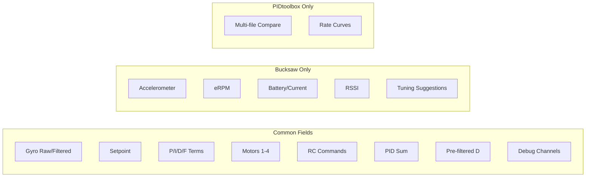

# Bucksaw vs PIDtoolbox - Feature Comparison

A comprehensive comparison of two flight log analysis tools for the Cleanflight family of drone firmwares.

---

## Executive Summary

| Aspect | Bucksaw | PIDtoolbox |
|--------|---------|------------|
| **Language** | Rust | MATLAB |
| **Platform** | Native + WebAssembly | Windows + Mac (standalone) |
| **Primary Focus** | Vibration/FFT + PID Analysis | Comprehensive PID Tuning |
| **Multi-file Compare** | Limited | Up to 10 files |
| **Learning Curve** | Simple | Advanced |
| **Cost** | Free/Open Source | Patreon (recent versions) |

---

## Feature Matrix

### Log Format Support

| Feature | Bucksaw | PIDtoolbox |
|---------|:-------:|:----------:|
| Betaflight | ✅ | ✅ |
| INAV | ✅ | ✅ |
| Emuflight | ✅ | ✅ |
| FETTEC | ❌ | ✅ |
| QuickSilver | ❌ | ✅ |
| Direct BBL parsing | ✅ (blackbox-log crate) | ❌ (uses blackbox_decode) |
| Multi-flight in single file | ✅ | ✅ |

### Time-Series Analysis

| Feature | Bucksaw | PIDtoolbox |
|---------|:-------:|:----------:|
| Gyroscope (raw) | ✅ | ✅ |
| Gyroscope (filtered) | ✅ | ✅ |
| Setpoint | ✅ | ✅ |
| PID P-term | ✅ | ✅ |
| PID I-term | ✅ | ✅ |
| PID D-term | ✅ | ✅ |
| PID F-term | ✅ | ✅ |
| PID Sum (P+I+D+F) | ✅ | ✅ |
| Pre-filtered D-term | ✅ | ✅ |
| Accelerometer | ✅ | ❌ |
| RC Commands | ✅ | ✅ |
| Motors (1-4) | ✅ | ✅ |
| Motors (5-8) | ✅ | ✅ |
| eRPM | ✅ | ❌ |
| Battery Voltage | ✅ | ❌ |
| Current Draw | ✅ | ❌ |
| RSSI | ✅ | ❌ |
| Debug Channels | ✅ | ✅ |
| Linked scrolling/zoom | ✅ | ❌ |
| Line smoothing | ✅ (5 levels) | ✅ (5 levels) |
| Line width adjustment | ✅ (0.5-5.0px) | ✅ (5 levels) |

### Spectral/FFT Analysis

| Feature | Bucksaw | PIDtoolbox |
|---------|:-------:|:----------:|
| Time-domain spectrogram | ✅ | ❌ |
| Throttle-domain spectrogram | ✅ | ✅ |
| 2D Amplitude Spectrum | ❌ | ✅ |
| Power Spectral Density (dB) | ❌ | ✅ |
| Gyro FFT | ✅ | ✅ |
| D-term FFT | ✅ | ✅ |
| PID Error FFT | ✅ | ✅ |
| Setpoint FFT | ✅ | ✅ |
| PID Sum FFT | ✅ | ✅ |
| FFT Size Options | 256-2048 | Dynamic |
| Colorscheme Options | 3 (Turbo/Viridis/Inferno) | 10+ |
| Sub-100Hz Focus Mode | ✅ | ✅ |
| Mean/Peak statistics | ❌ | ✅ |

### Step Response Analysis

| Feature | Bucksaw | PIDtoolbox |
|---------|:-------:|:----------:|
| Step Response Calculation | ✅ | ✅ |
| Algorithm | FFT deconvolution | LOWESS + deconvolution |
| Per-axis analysis | ✅ | ✅ |
| Display duration | 500ms | 500ms |
| Smoothing options | ✅ (4 levels: Off/Low/Medium/High) | ✅ (4 levels) |
| Y-axis correction | ✅ (-0.5 to +0.5 slider) | ✅ |
| Adjustable Y scale | ✅ (0.3 to 2.0 slider) | ✅ |
| Multi-file overlay | ❌ | ✅ (up to 10) |

### Flight Statistics

| Feature | Bucksaw | PIDtoolbox |
|---------|:-------:|:----------:|
| Stick usage histograms | ✅ (Roll/Pitch/Yaw/Throttle) | ✅ |
| Rate curve visualization | ✅ | ✅ |
| PID term mean/SD bars | ✅ (Gyro/P/I/D/F per axis) | ✅ |
| Motor balance visualization | ✅ (Mean ± SD per motor) | ✅ |
| Cross-axis trajectory | ✅ (Roll vs Pitch) | ✅ |
| Throttle acceleration coloring | ✅ (Blue→Red gradient) | ✅ |

### PID Error Analysis

| Feature | Bucksaw | PIDtoolbox |
|---------|:-------:|:----------:|
| PID Error distribution | ✅ (normalized to peak=1.0) | ✅ |
| Error vs stick deflection | ✅ (10 buckets, std error bars) | ✅ |
| Statistical comparison (KS-test) | ❌ | ✅ |
| Rate threshold filtering | ✅ (500 deg/s max) | ✅ |
| Mean absolute error display | ✅ | ✅ |
| Two-file comparison | ❌ | ✅ |

### Setup Information

| Feature | Bucksaw | PIDtoolbox |
|---------|:-------:|:----------:|
| Display firmware version | ✅ | ✅ |
| Display board info | ✅ | ✅ |
| Display craft name | ✅ | ✅ |
| Display sample rate | ✅ | ✅ |
| Display log duration | ✅ | ❌ |
| Display PID values | ✅ (organized by category) | ✅ |
| Display rates/expo/super | ✅ | ✅ |
| Display filter settings | ✅ (gyro/D-term/notch/RPM) | ✅ |
| Display motor/ESC settings | ✅ | ✅ |
| Display debug mode | ✅ | ✅ |
| Display enabled features | ✅ | ❌ |
| All raw settings view | ✅ (collapsible, sorted) | ✅ |

### Tuning Suggestions (NEW)

| Feature | Bucksaw | PIDtoolbox |
|---------|:-------:|:----------:|
| Automated PID analysis | ✅ | ❌ |
| Step response overshoot detection | ✅ | ❌ |
| Oscillation detection | ✅ | ❌ |
| D-term noise analysis | ✅ | ❌ |
| Gyro noise analysis | ✅ | ❌ |
| Motor saturation detection | ✅ | ❌ |
| Tracking error analysis | ✅ | ❌ |
| Smart Betaflight CLI commands | ✅ | ❌ |
| P/D gain recommendations | ✅ | ❌ |
| Filter recommendations | ✅ | ❌ |
| Severity-coded suggestions | ✅ (Info/Warning/Critical) | ❌ |

---

## Algorithm Comparison

### Step Response Calculation

**Bucksaw (Rust)**
```rust
pub fn calculate_step_response(times, setpoint, gyro_filtered, sample_rate, smoothing) {
    // 1. Apply moving average smoothing (configurable)
    smoothed_gyro = apply_smoothing(gyro_filtered, smoothing.window_size());
    
    // 2. FFT of setpoint and smoothed gyro
    input_spectrum = fft_forward(setpoint);
    output_spectrum = fft_forward(smoothed_gyro);
    
    // 3. Calculate frequency response via conjugate method
    frequency_response = (conj(input) * output) / (conj(input) * input);
    
    // 4. Inverse FFT to get impulse response
    impulse_response = fft_inverse(frequency_response);
    
    // 5. Cumulative sum for step response
    step_response = cumsum(impulse_response);
    
    // 6. Normalize by average, limit to 500ms
    return normalized.take(sample_rate / 2);
}
```

**PIDtoolbox (MATLAB)**
```matlab
function [stepresponse, t] = PTstepcalc(SP, GY, lograte, Ycorrection, smoothFactor)
    % 1. Apply LOWESS smoothing to gyro
    smoothVals = [1 20 40 60];
    GY = smooth(GY, smoothVals(smoothFactor), 'lowess');
    
    % 2. Segment into 2-second windows
    segment_length = lograte * 2000;
    wnd = lograte * 1000 * 0.5;  % 500ms output window
    
    % 3. Deconvolution
    % 4. Apply Y correction if enabled
    % 5. Return normalized response
end
```

**Key Differences:**
| Aspect | Bucksaw | PIDtoolbox |
|--------|---------|------------|
| Pre-processing | Moving average (configurable) | LOWESS smoothing |
| Windowing | Full log | 2-second segments |
| Normalization | By average | Configurable |
| Y correction | ✅ Slider (-0.5 to +0.5) | ✅ Toggle |
| Smoothing levels | Off/Low(5)/Medium(15)/High(31) | 4 levels (LOWESS spans) |

### PID Error Analysis

**Bucksaw Implementation (matching PIDtoolbox):**
- Error calculation: `setpoint - gyro_filtered`
- Histogram normalization: `bins / max(bins)` (peak = 1.0)
- Outlier filtering: samples where all axes < 500 deg/s
- Error vs stick: 10 buckets by % of max deflection
- Error bars: Standard error = `std / sqrt(n)`

### FFT/Spectrogram

**Bucksaw**
- Uses `realfft` crate for real-valued FFT
- Applies Hamming window: `w[i] = 0.53836 * (1 - cos(2π * i / N))`
- Fixed FFT sizes: 256, 512, 1024, 2048
- Color intensity: `log10(|FFT|²)`

**PIDtoolbox**
- Uses MATLAB's built-in FFT
- Gaussian filter for smoothing: `fspecial('gaussian', [n*5, n], 4)`
- Dynamic FFT size based on log rate
- Supports both amplitude and PSD (dB) modes
- Throttle binning: 100 bins (1% resolution)

---

## Performance Comparison

| Metric | Bucksaw | PIDtoolbox |
|--------|---------|------------|
| Startup time | Fast | Moderate (MATLAB runtime) |
| Large file handling | Excellent | Good |
| Memory usage | Low | High (MATLAB overhead) |
| FFT computation | Background threads | MATLAB FFT |
| UI responsiveness | Excellent | Good |
| WASM performance | Reduced | N/A |

---

## User Interface Comparison

**Bucksaw**
- Modern, minimalist design
- Tabbed interface: Plot, Tune, Vibe, Stats, Error, Setup, **Suggestions**
- Dark mode with Gruvbox colors
- Linked plot navigation
- Drag and drop file loading
- Interactive controls for step response (smoothing, Y correction, Y scale)
- **Automated tuning suggestions** based on log analysis

**PIDtoolbox**
- Feature-rich control panels
- Multiple windows for each analysis type
- Extensive configuration options
- Tooltip help on every control
- Save/load user preferences
- Multi-file comparison mode

---

## Use Case Recommendations

### Choose Bucksaw when:
- ✅ You need quick vibration analysis
- ✅ You prefer web-based access (no installation)
- ✅ You want linked plot navigation
- ✅ You need to analyze eRPM data
- ✅ You want a simple, fast interface
- ✅ You're on Linux
- ✅ You want comprehensive setup info at a glance
- ✅ You need PID error analysis similar to PIDtoolbox
- ✅ You want flight statistics (stick usage, motor balance)

### Choose PIDtoolbox when:
- ✅ You need to compare multiple flight logs (up to 10)
- ✅ You need cross-axis trajectory analysis
- ✅ You need statistical significance testing (KS-test)
- ✅ You work with FETTEC or QuickSilver logs
- ✅ You need rate curve visualization
- ✅ You need debug channel analysis

---

## Data Field Coverage



---

## Summary

| Category | Winner | Notes |
|----------|--------|-------|
| Simplicity | **Bucksaw** | Cleaner UI, fewer options |
| Features | **Bucksaw** | Now has more unique features |
| Performance | **Bucksaw** | Native Rust, lower overhead |
| Multi-file Comparison | **PIDtoolbox** | Up to 10 files |
| Vibration Analysis | **Tie** | Both excellent |
| PID Tuning | **Bucksaw** | Adds automated suggestions |
| Accessibility | **Bucksaw** | WebAssembly version |
| Statistics | **Tie** | Both have stick/motor stats |
| PID Error Analysis | **Tie** | Both have error distributions |
| Setup Info | **Bucksaw** | Better organized, more data |
| Tuning Assistance | **Bucksaw** | Unique automated suggestions |

Both tools are now very capable. **Bucksaw** excels in quick analysis with a modern interface, cross-platform support, and **unique automated tuning suggestions** that analyze your flight log and recommend specific PID/filter changes. **PIDtoolbox** remains the choice for multi-log comparison and advanced statistical testing.

---

*Comparison based on Bucksaw (December 2024) and PIDtoolbox v0.58*

