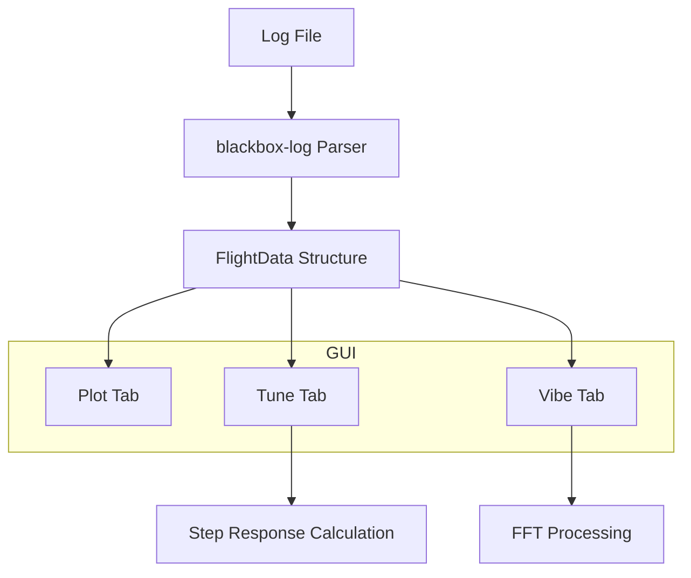
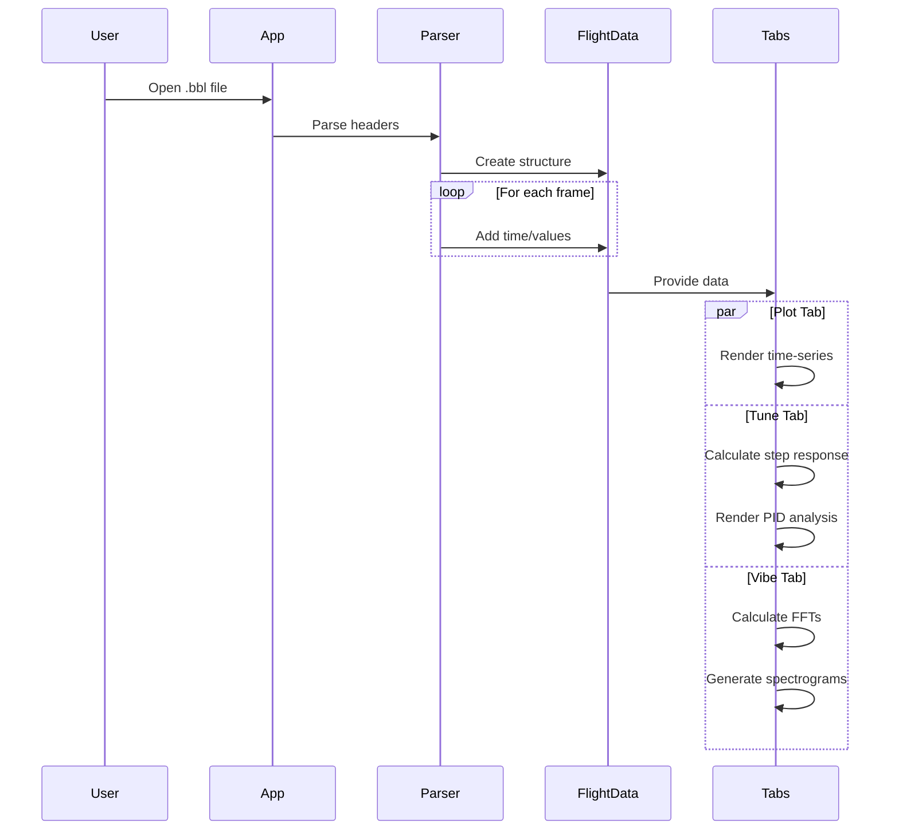

# Bucksaw - Flight Log Analyzer Documentation

A comprehensive tool for analyzing flight logs from drones using the Cleanflight family of firmwares (Betaflight, INAV). Primary use cases include vibration analysis and PID tune performance evaluation.

---

## Table of Contents

1. [Overview](#overview)
2. [Architecture](#architecture)
3. [Data Parsing Rules](#data-parsing-rules)
4. [Analysis Features](#analysis-features)
5. [Signal Processing Rules](#signal-processing-rules)
6. [Visualization Rules](#visualization-rules)
7. [Configuration Options](#configuration-options)
8. [Build & Setup](#build--setup)

---

## Overview

Bucksaw is a Rust-based application that parses and visualizes blackbox flight logs. It supports both native desktop and WebAssembly deployment.

### Supported Firmwares
- **Betaflight**
- **INAV**
- Other Cleanflight-family firmwares

### Key Capabilities
- Time-series plotting of all flight telemetry
- FFT-based vibration analysis
- PID tune analysis with step response calculation
- Multi-flight comparison
- Cross-platform (native + WASM)

---

## Architecture



### Core Modules

| Module | File | Purpose |
|--------|------|---------|
| Flight Data | `src/flight_data.rs` | Parses and stores flight log data |
| Step Response | `src/step_response.rs` | FFT-based step response calculation |
| Plot Tab | `src/gui/tabs/plot.rs` | Time-series visualization |
| Tune Tab | `src/gui/tabs/tune.rs` | PID tuning analysis |
| Vibe Tab | `src/gui/tabs/vibe.rs` | Vibration/FFT analysis |
| Colors | `src/gui/colors.rs` | Gruvbox color scheme |
| Iterator Utils | `src/iter.rs` | Overlapping window iterator |

---

## Data Parsing Rules

### Supported Data Fields

Flight logs are parsed into the `FlightData` structure with the following data series:

#### Gyroscope Data
| Field | Accessor | Description |
|-------|----------|-------------|
| `gyroUnfilt[0-2]` | `gyro_unfiltered()` | Raw gyroscope readings (Roll, Pitch, Yaw) in °/s |
| `gyroADC[0-2]` | `gyro_filtered()` | Filtered gyroscope readings in °/s |

#### Accelerometer Data
| Field | Accessor | Description |
|-------|----------|-------------|
| `accSmooth[0-2]` | `accel()` | Smoothed accelerometer readings in m/s² |

#### RC Commands
| Field | Accessor | Description |
|-------|----------|-------------|
| `rcCommand[0-3]` | `rc_command()` | RC command values (Roll, Pitch, Yaw, Throttle) |
| `setpoint[0-3]` | `setpoint()` | Setpoint values after rate processing |

#### PID Controller Data
| Field | Accessor | Description |
|-------|----------|-------------|
| `axisP[0-2]` | `p()` | Proportional term output |
| `axisI[0-2]` | `i()` | Integral term output |
| `axisD[0-2]` | `d()` | Derivative term output (may not exist for all axes) |
| `axisF[0-2]` | `f()` | Feedforward term output |

#### Motor & ESC Data
| Field | Accessor | Description |
|-------|----------|-------------|
| `motor[0-N]` | `motor()` | Motor output values (supports up to 8 motors) |
| `eRPM[0-N]` | `electrical_rpm()` | Electrical RPM from ESC telemetry |

#### Power & Telemetry
| Field | Accessor | Description |
|-------|----------|-------------|
| `vbatLatest` | `battery_voltage()` | Battery voltage in V |
| `amperageLatest` | `amperage()` | Current draw in A |
| `rssi` | `rssi()` | Received Signal Strength Indicator |

### Unit Conversions
The parser automatically handles unit conversions based on the log format:

| Original Unit | Converted To |
|---------------|--------------|
| Amperage | Amperes (A) |
| Voltage | Volts (V) |
| Acceleration | m/s² |
| Rotation | deg/s (converted from rad/s) |

### Sample Rate Calculation
The sample rate is calculated using the median of the first 100 frame intervals:

```
sample_rate = 1,000,000 / median_interval_μs
```

The result is rounded to the nearest 100Hz (e.g., 4000Hz, 8000Hz).

### Time Validation Rule
Frames with timestamps less than the previous frame's timestamp are **skipped** to handle log corruption or wrap-around issues.

---

## Analysis Features

### 1. Plot Tab

The Plot Tab provides time-series visualization of all telemetry data:

#### Available Plots
1. **Gyroscope** - Raw and filtered gyro data for all 3 axes
2. **Accelerometer** - Smoothed accelerometer data for all 3 axes
3. **RC Commands** - All 4 RC channels (Roll, Pitch, Yaw, Throttle)
4. **Motors** - Motor output values (typically 4 motors)
5. **eRPM** - Electrical RPM from bidirectional DSHOT
6. **Battery** - Voltage and current draw
7. **RSSI** - Signal strength over time

#### Interaction Rules
- All plots are linked for synchronized scrolling and zooming
- Cursors are linked across all plots for time correlation
- Legends are displayed in the top-left corner

---

### 2. Tune Tab

The Tune Tab analyzes PID controller performance:

#### Time Domain Analysis
For each axis (Roll, Pitch, Yaw), displays:
- Gyro (unfiltered) - Raw rotation rate
- Gyro (filtered) - Filtered rotation rate
- Setpoint - Desired rotation rate
- P term - Proportional contribution
- I term - Integral contribution
- D term - Derivative contribution
- F term - Feedforward contribution

#### Step Response Analysis
Calculates the system's step response using signal processing:

**Algorithm:**
1. Compute FFT of setpoint signal
2. Compute FFT of filtered gyro signal
3. Calculate frequency response: `H(f) = conj(Input) * Output / (conj(Input) * Input)`
4. Inverse FFT to get impulse response
5. Cumulative sum to get step response
6. Normalize by average value
7. Display first 500ms of response

**Interpretation Rules:**
| Step Response Shape | Indication |
|---------------------|------------|
| Fast rise, no overshoot | Well-tuned |
| Overshoot > 10% | P gain too high |
| Slow rise time | P/D gains too low |
| Oscillations | Filter or tune issues |

---

### 3. Vibe Tab (Vibration Analysis)

The Vibe Tab provides FFT-based spectral analysis:

#### Analysis Domains

**Time Domain:**
- X-axis: Time (seconds)
- Y-axis: Frequency (Hz)
- Color intensity: FFT magnitude

**Throttle Domain:**
- X-axis: Throttle percentage (0-100%)
- Y-axis: Frequency (Hz)
- Color intensity: Averaged FFT magnitude per throttle bin

#### Data Series
| Series | Description |
|--------|-------------|
| Gyro (raw) | Unfiltered gyroscope FFT |
| Gyro (filtered) | Filtered gyroscope FFT |
| D term (raw) | Raw D-term FFT (not yet implemented) |
| D term (filtered) | Filtered D-term FFT |

---

## Signal Processing Rules

### FFT Configuration

| Parameter | Options | Default | Description |
|-----------|---------|---------|-------------|
| FFT Size | 256, 512, 1024, 2048 | 256 | Samples per FFT window |
| Step Size | 1, 8, 32, 128, 256, 512, 1024 | 8 | Samples between windows |
| FFT Max | 0.0 - 100.0 | 10.0 | Maximum value for color scaling |

**Rule:** Step size must be ≤ FFT size

### Hamming Window
All FFT calculations apply a Hamming window to reduce spectral leakage:

```
w[i] = 0.53836 * (1 - cos(2π * i / N))
```

### Frequency Range
Maximum displayable frequency is limited by the Nyquist frequency:
```
max_frequency = sample_rate / 2
```

### Throttle Bucketing
For throttle-domain analysis:
- 256 throttle buckets (0-100%)
- FFT values are averaged within each bucket
- Empty buckets are displayed as transparent

---

## Visualization Rules

### Color Scheme (Gruvbox)

The application uses the Gruvbox color palette with dark/light mode support:

#### PID/Telemetry Colors
| Element | Dark Mode | Light Mode |
|---------|-----------|------------|
| Gyro (unfiltered) | Red | Red |
| Gyro (filtered) | Light Red | Dark Red |
| Setpoint | Foreground | Foreground |
| P term | Light Green | Dark Green |
| I term | Light Blue | Dark Blue |
| D term | Light Orange | Dark Orange |
| F term | Yellow | Yellow |
| Voltage | Light Blue | Dark Blue |
| Current | Light Red | Dark Red |
| RSSI | Light Aqua | Dark Aqua |

#### Motor Colors (up to 8 motors)
Position 1-4: Yellow, Purple, Aqua, Orange
Position 5-8: Red, Green, Blue, Foreground

#### FFT Colorschemes
| Name | Description |
|------|-------------|
| Turbo | Rainbow colormap (blue → red) |
| Viridis | Perceptually uniform (purple → yellow) |
| Inferno | Black → red → yellow (default) |

### Plot Layout Rules

#### Responsive Design
- **Wide mode** (width > 1500px): Columns side-by-side
- **Narrow mode**: Columns stacked vertically

#### Plot Heights
- Standard plot height constant: `PLOT_HEIGHT` 
- In narrow mode, plots divide available height among axes

#### Axis Formatting
- Y-axis positioned on the right side
- Y-axis width: 3 characters
- Frequency axis: Displays as Hz
- Throttle axis: Displays as percentage

---

## Configuration Options

### Application Settings

| Setting | Location | Description |
|---------|----------|-------------|
| Theme | Automatic | Dark/light mode based on system |
| Plot linking | Default enabled | Synchronized pan/zoom across plots |
| Cursor linking | Default enabled | Synchronized cursor position |

### Debug Mode Awareness
The parser preserves the firmware's debug mode setting, which affects available data fields:
- `DebugMode::GYRO_SCALED`
- `DebugMode::PID_LOOP`
- And others...

### ESC Protocol Detection
The ESC protocol is automatically detected and displayed:
- DSHOT150/300/600/1200
- Multishot
- OneShot125/42
- Standard PWM

---

## Build & Setup

### Native Build

```bash
# Install Rust
curl --proto '=https' --tlsv1.2 -sSf https://sh.rustup.rs | sh

# Run debug build
cargo run

# Install release build
cargo install --path .

# With profiling support
cargo run --features profiling
```

### WebAssembly Build

```bash
# Install trunk
cargo install trunk

# Development server
trunk serve --open

# Production build
trunk build --release
# Copy /dist folder to web server
```

### Dependencies

| Crate | Purpose |
|-------|---------|
| `blackbox-log` | Betaflight blackbox log parser |
| `realfft` | Real-valued FFT implementation |
| `eframe/egui` | GUI framework |
| `egui_plot` | Plotting widgets |
| `egui_oszi` | Oscilloscope-style timeseries plots |
| `colorgrad` | Color gradient generation |
| `rfd` | Native file dialogs |

---

## Performance Considerations

### WebAssembly Limitations
> ⚠️ **Warning:** The web version has reduced performance compared to native. Be careful with:
> - Larger FFT sizes (1024, 2048)
> - Large log files
> - Extended flight recordings

### Background Processing
Long-running computations are executed in background threads:
- FFT calculations
- Step response computation
- Texture generation

The UI remains responsive during processing, with progress indicators where applicable.

### Memory Management
- FFT textures are created in chunks to limit memory usage
- Time-domain textures: 1024 columns per texture
- Throttle-domain: Single 256-column texture

---

## Appendix: Data Flow



---

*Documentation generated for Bucksaw flight log analyzer. For the latest updates, visit the [GitHub repository](https://github.com/KoffeinFlummi/bucksaw).*
